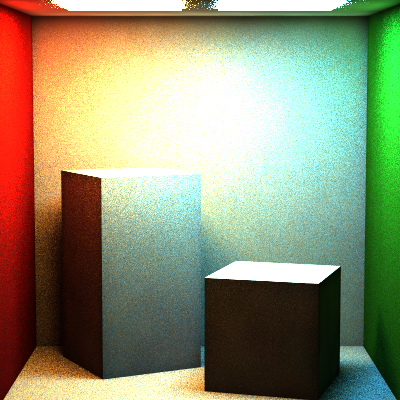
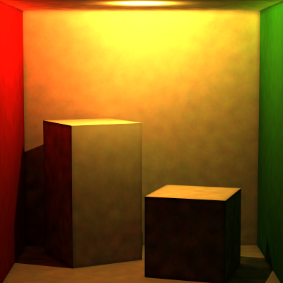
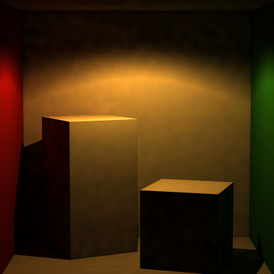
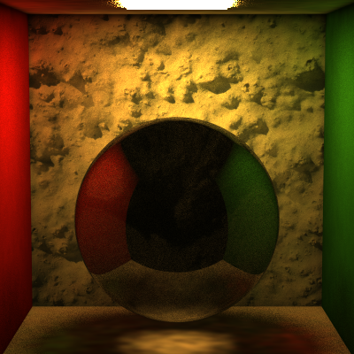
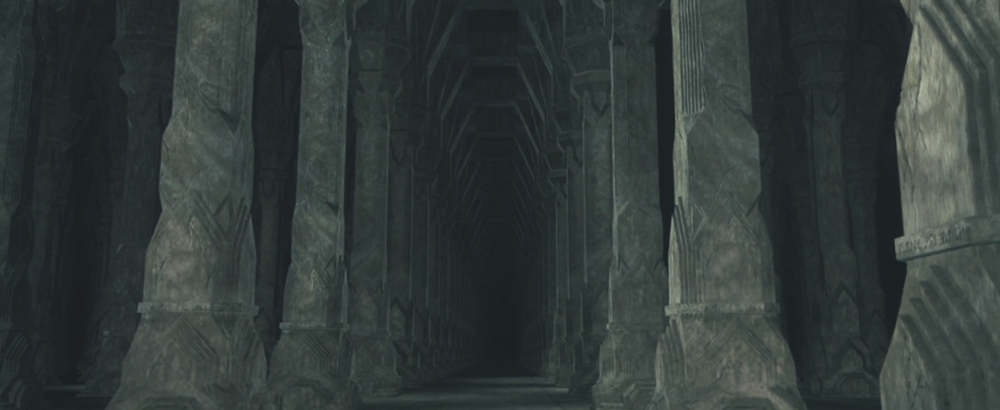
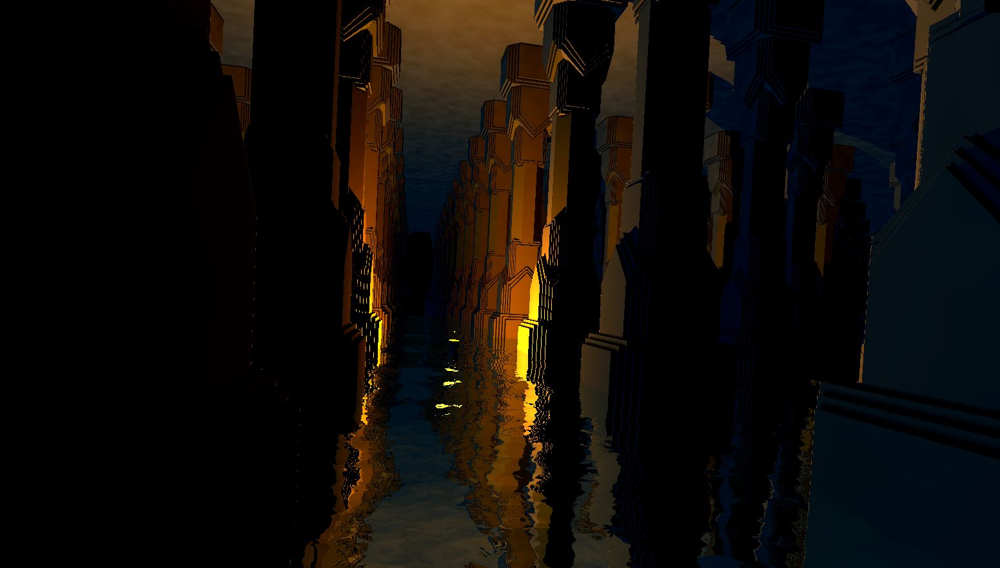
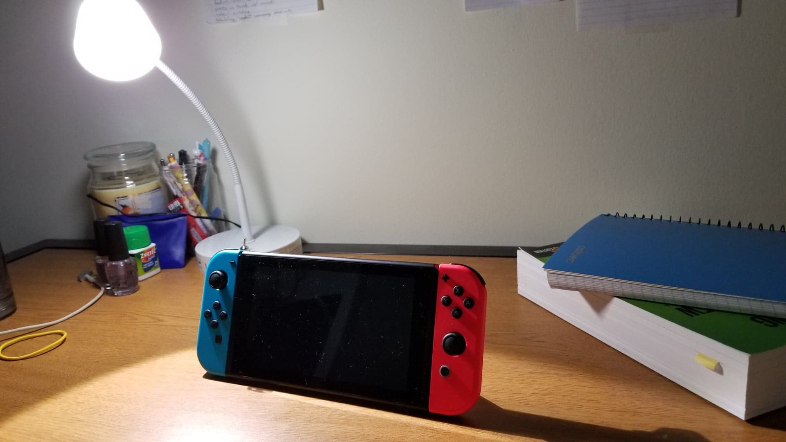
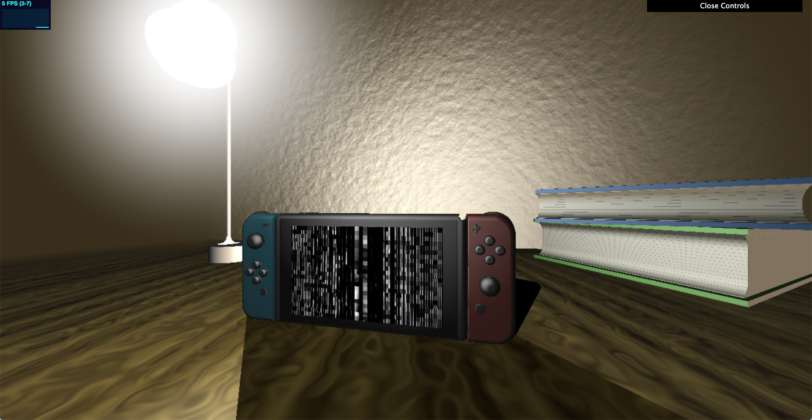
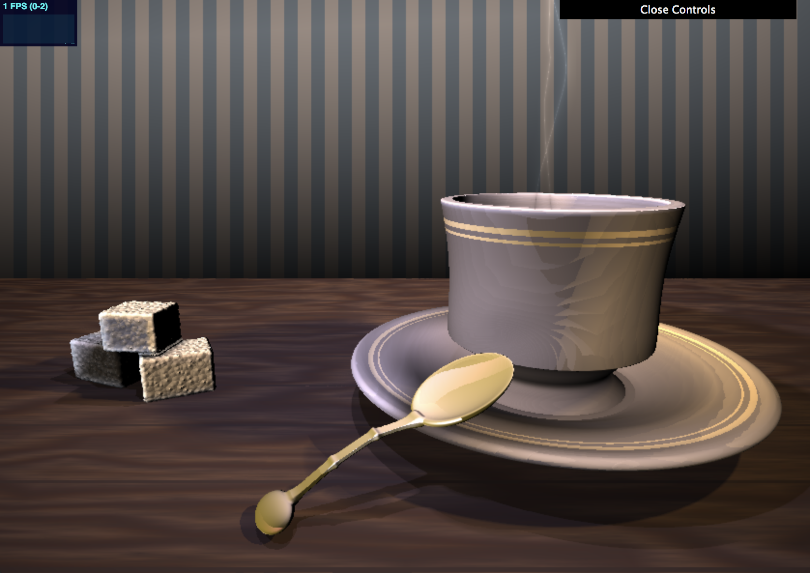
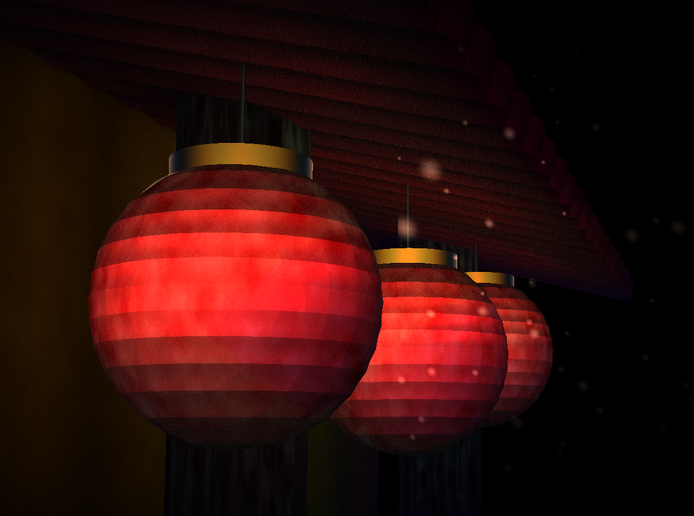

Final Project
======================

**University of Pennsylvania, CIS 561: Advanced Computer Graphics, Final Project**

Result
------------

Two Lights

Point Light

Spot Light

Caustic

Overview
------------
As the semester draws to its close, we embark on the final project.
You have two options for this project: implement one large addition to your
path tracer, or use the real-time rendering techniques explored in hw09
to create a polished real-time render.
We will not provide any base code for this assignment; it is up to you to
create any classes you will need to complete your feature(s).

Useful Reading
---------
The following PBRT chapters are relevant to the features listed for this
assignment:
* Chapter 15: Volume Rendering
* Chapter 16: Bidirectional Methods

Additionally, you may find these articles useful:
* [3D SDFs and Transformation Techniques](https://www.iquilezles.org/www/articles/distfunctions/distfunctions.htm)
* [Penumbra shadows](https://www.iquilezles.org/www/articles/rmshadows/rmshadows.htm)
* [Better distance fog](https://www.iquilezles.org/www/articles/fog/fog.htm)
* [Outdoor lighting](https://www.iquilezles.org/www/articles/outdoorslighting/outdoorslighting.htm)

Submitting final renders (15 points)
-------------
The deadline for code completion and submission is Tuesday, April 29 at midnight.
However, you may take up until Wednesday, April 30 at 12:00 noon to submit
final renders from your path tracer or raymarcher. On Wednesday, April 30 we will run
through a slide show of everyone's renders, allocating at most 2 minutes per
student.

Please provide any captions you deem important to your renders, including
listing the features each render is showcasing.

If you extend your path tracer,
we expect at least one of your rendered images to be demo-reel worthy,
meaning a minimum of 1024x1024 pixels and a high level of convergence
(at least 20x20 samples per pixel) along with measured render times.

If you implement a raymarched real-time render, you will submit at least one
screenshot of it along with a hyperlink to its ShaderToy page.

If you wish, you may discuss your renders and features during your 2 minutes.

Submit your renders both in your Github repository and in [this Google
Slides set](https://docs.google.com/presentation/d/1t250tDW5jRiJcOjV0VJnlorIPPXQ4BD329iAFctoK0w/edit?usp=sharing), so we can present them in class.

You can view previous years' path tracer renders here:
- [2017](https://docs.google.com/presentation/d/1Wjy67RAZ9VowliNTujy45HjSEcaAZf7i3WYb_prdhe8/edit#slide=id.g1d7d691b44_0_10)
- [2018](https://docs.google.com/presentation/d/1NzG9TVk7yWxe90ShlFyNXGB2bJuZZb6_jizqvOiWf7o/edit#slide=id.g1d7d691b44_0_10)
- [2019](https://docs.google.com/presentation/d/1t250tDW5jRiJcOjV0VJnlorIPPXQ4BD329iAFctoK0w/edit?usp=sharing)

Option I: An addition to your path tracer (100 points + 15 pts extra credit)
------------------
Implement __one__ of the features listed below to expand your path tracer. Note that this option is also worth fifteen bonus points.
* #### Photon Mapper
Implement a basic photon mapper that stores a set of global illumination
photons and a set of caustic photons. Rather than storing a set of direct
lighting photons, your renderer will simply evaluate the direct lighting at a
point using multiple importance sampling as in your path tracer. If you wish,
you may try to make your renderer more efficient by also including a radiance
photon map, which stores the average of a set of surrounding photons. Finally,
you will have to incorporate a volumetric data structure (e.g. a voxel grid or
kd-tree) in order to better store your photons and evaluate where they land.
* #### Path Tracing with Participating Media (Volumetric Rendering)
Implement an integrator in your path tracer capable of handling participating
media. We require that it handle _at least_ homogeneous media, but we encourage
you to implement heterogeneous media as well. For interesting renders, try
incorporating transmissive spheres to focus light beams through the medium.
* #### Bidirectional Path Tracer
Implement an integrator that performs bidirectional path tracing. This type of
path tracing is especially effective in scenes where the light sources are
highly occluded, such as a scene where a light is enclosed by a transmissive
object. In these scenarios, the direct lighting computation at each path vertex
will almost never produce light energy, making the scene illuminated almost
entirely by global illumination. By tracing rays from both the light sources
and the camera, we ensure that our ray paths eventually reach the light source,
even without a direct lighting pass. For your bidirectional engine, we only
require naive integration; incorporating multiple importance sampling into such
a renderer is actually more complicated than one might expect.

Option II: An advanced render using ShaderToy
--------------------
Using the techniques explored in hw09, render a raymarched scene in ShaderToy.
Specifically, your scene should be inspired by some pre-existing work of art,
whether it is a painting, a photograph, a movie, or even one of your own creations.
You need not replicate the inspiration piece exactly, but your render should clearly
match it in aesthetic, composition, or theme.

Your scene __must incorporate animation somehow__, even if your inspiration does not.
Additionally, your scene __must__ incorporate procedural texturing using some
sort of 1D/2D/3D function (whether the function is a noise function is up to you).
You must not use any built-in textures provided by ShaderToy.

Your scene must incorporate at least four of the following elements:
* Penumbra shadows
* Subsurface scattering
* Specular reflection
* Specular transmission
* Blinn-Phong reflection
* Depth of field
* Ambient occlusion
* Participating medium (homogeneous or heterogeneous)
* Approximated global illumination via hard-coded lights
* Repetition of SDFs using modulo (refer to [3D SDFs and Transformation Techniques](https://www.iquilezles.org/www/articles/distfunctions/distfunctions.htm))
* Smooth blending of SDFs (refer back to hw03)
* CSG operations on SDFs (refer to [3D SDFs and Transformation Techniques](https://www.iquilezles.org/www/articles/distfunctions/distfunctions.htm))

75% of your scene's score will be based on your technique implementation (i.e.
does it meet the requirements listed above). The remaining 25% will be based on
how well we deem your render aligns with the inspiration piece you chose. In other
words, how much effort did you put into following the aesthetic, composition, or theme
of your inspiration piece? If your scene looks like a basic Lambert-shaded render
straight out of the Maya preview window, you won't receive many points.

Below are some examples of students' inspirations and resulting scenes:

 

 

 

 

Submitting your project
--------------
Along with your project code, make sure that you fill out this `README.md` file
with your name and PennKey, along with your test renders.

Rather than uploading a zip file to Canvas, you will simply submit a link to
the committed version of your code you wish us to grade. If you click on the
__Commits__ tab of your repository on Github, you will be brought to a list of
commits you've made. Simply click on the one you wish for us to grade, then copy
and paste the URL of the page into the Canvas submission form.
